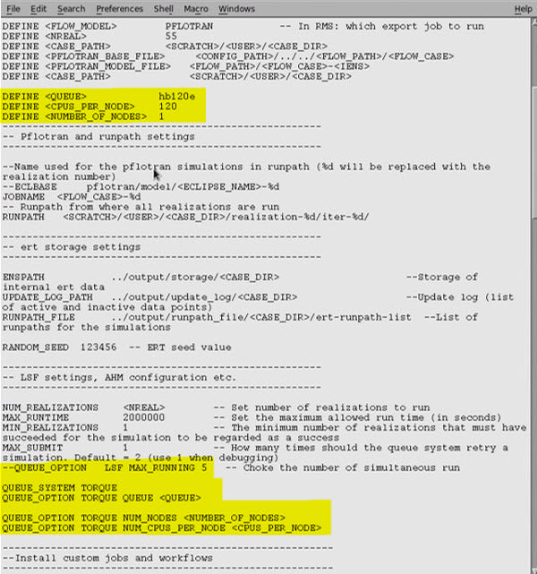

#FMU on Azure

## 🎯 Overview & context

In order to run FMU on your Azure subscription using Pflotran, a few modifications need to take place in your ERT config file:

- Change in queue system
- Use of Pflotran instead of Eclipse
- Opt: add post-processing scripts to analysis results on Webviz

Other queues exist and will influence computational power & cost. ​Reach out to Hans Rune Bue to know more.

## 📝 Set-by-step

- Queue system: `hb120e`, `hb120`
 
 

- Pflotran:

    `FORWARD_MODEL RUN_PFLOTRAN(<queue>=<QUEUE>, <cpus_per_node>=<CPUS_PER_NODE>, <number_of_nodes>=<NUMBER_OF_NODES>, <model_file>=<RUNPATH>/pflotran/model/<ECLIPSE_NAME>-<IENS>.in)`

- Post-processing scripts:

    To know more, visit the following section of the documentation about [Webviz](https://fmu-for-ccs.radix.equinor.com/webviz/overview/).

## 📜 Example

Example of ERT config file. Changes in queues have been highlighted:

