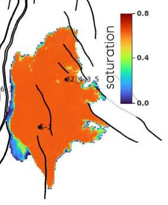

# Aggregation maps

## 🎯 Overview




## 📝 How to set it up?

### ERT

✅ Available on Komodo

```yaml
FORWARD_MODEL GRID3D_AGGREGATE_MAP(<ECLROOT>=<ECLBASE>, <CONFIG_AGGREGATE>=<CONFIG_PATH>/../input/config/grid3d_aggregate_map.yml)
```

### Config file

Config file are to be placed in `ert/input/config` folder. Here is a template example:

~~~ yaml title="grid3d_aggregate_map.yml"

~~~


## 📚 Other config file example

~~~ yaml title="Example 1"

~~~


## 🔧 Versions & updates

**Future development**
<br />
<br />

**Updates**
