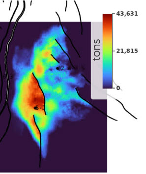

# Mass maps

## Overview



## How to set it up?

### ERT

❌ Not available on Komodo yet! A local installation is needed for now. Follow the instructions below to test it:


```yaml
FORWARD_MODEL GRID3D_MIGRATION_TIME(<ECLROOT>=<ECLBASE>, <CONFIG_MIGTIME>=<CONFIG_PATH>/../input/config/grid3d_migration_time.yml)
```

### Config file

Config file are to be placed in `ert/input/config`

Template example:

~~~ yaml title="grid3d_co2_mass_map.yml"

~~~


### Versions
