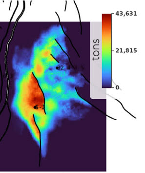

# Mass maps

## 🎯 Overview



## 📝 How to set it up?

### ERT

✅ Available on Komodo

```yaml
FORWARD_MODEL CO2_MASS_MAP(<ECLROOT>=<ECLBASE>, <CONFIG_CO2_MASS_MAPS>=<CONFIG_PATH>/../input/config/grid3d_co2_mass_map.yml )
```


### Config file

Config file are to be placed in `ert/input/config` folder. Here is a template example:

~~~ yaml title="grid3d_co2_mass_map.yml"

~~~

## 📚 Other config file example

~~~ yaml title="grid3d_co2_mass_map.yml"

~~~

## 🔧 Versions & updates

**Future development**


<br />
<br />

**Updates**
**May 2024**:
- Made available in Komodo stable.