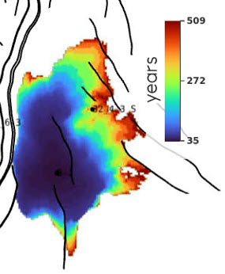

# Migration time maps

## 🎯 Overview



## 📝 How to set it up?

### ERT


✅ Available on Komodo

```yaml
FORWARD_MODEL GRID3D_MIGRATION_TIME(<ECLROOT>=<ECLBASE>, <CONFIG_MIGTIME>=<CONFIG_PATH>/../input/config/grid3d_migration_time.yml)
```

### Config file

Config file are to be placed in `ert/input/config`

Template example:

~~~ yaml title="grid3d_migration_time.yml"

~~~

## 📚 Other config file example

~~~ yaml title="Example 1"

~~~

~~~ yaml title="Example 2"

~~~

## 🔧 Versions & updates


**Future development**
<br />
<br />

**Updates**