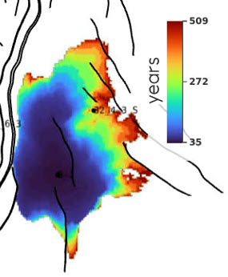

# Migration time maps

## 🎯 Overview

Returns one map per formation howing the time it takes for the CO2 to migrate to a certain point. 

**Limitations**

The config file only accepts one property at a time. 




## 📝 How to set it up?

### ERT


✅ Available on Komodo

```yaml
FORWARD_MODEL GRID3D_MIGRATION_TIME(<ECLROOT>=<ECLBASE>, <CONFIG_MIGTIME>=<CONFIG_PATH>/../input/config/grid3d_migration_time.yml)
```
```yaml
FORWARD_MODEL GRID3D_MIGRATION_TIME(<ECLROOT>=<ECLBASE>, <CONFIG_MIGTIME>=<CONFIG_PATH>/../input/config/grid3d_migration_time.yml)
```

### Config file

Config file are to be placed in `ert/input/config` folder. Here is a template example:

~~~ yaml title="grid3d_migration_time.yml"

~~~

## 📚 Other config file example

Config file with zonation in model defined by listing the zones and corresponding z ranges:

~~~ yaml title="grid3d_migration_time.yml "

~~~


## 🔧 Versions & updates


**Future development**

- Extend the script to produce Migration time map for CO2 dissolved in water (AMFG / XMF2), in addition to SGAS. 

<br />
<br />

**Updates**