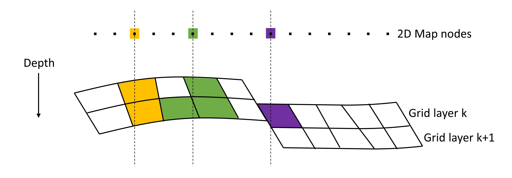
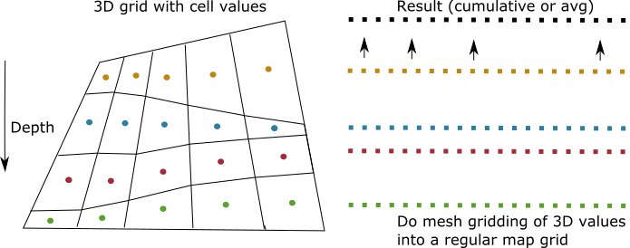

#Theory

## Migration time & Aggregation maps

*grid3d_aggregate_map* and *grid3d_migration_time* uses a different approach when aggregating values. In general, the main difference from *grid3d_hc_thickness* and *grid3d_average_map* is that the result will be less smooth. Secondly, gaps in the grid (typically caused by faults), will not be filled.

Each map node is first connected to all cells whose (approximate) footprint overlaps the map node. An artificial set of connections are illustrated by colors in the figure above.

Once the connections are established, the value of each map node is calculated from all the connected grid cells via one of the specified aggregation methods:

- Maximum
- Minimum
- Mean
- Sum

Layer information and lateral distance from map node to grid cell center is currently not used. However, filters can be used to apply this per zone etc.

One benefit of this approach is that the map-node-to-grid-cell connection information can be re-used across time steps and properties, as long as the grid geometry does not change. This is beneficial for performance.

## Thickness & Average maps
The scripts reads the Eclipse files or ROFF files and computes HCPV thickness or weighted average of a property, per cell, layer by layer.

Then the value and position of each 3D cell (per layer) is then gridded by a scipy/matplotlib method to form a regular map.

For HC thickness, the maps per layers are then summed, to form a sum hc thickness map per zone or by all zones that are spesified.

For average maps, a thickness weighted average is computed.

This is not applicable to grid3d_aggregate_map and grid3d_migration_time, which uses a different approach for aggregating layers.

## 