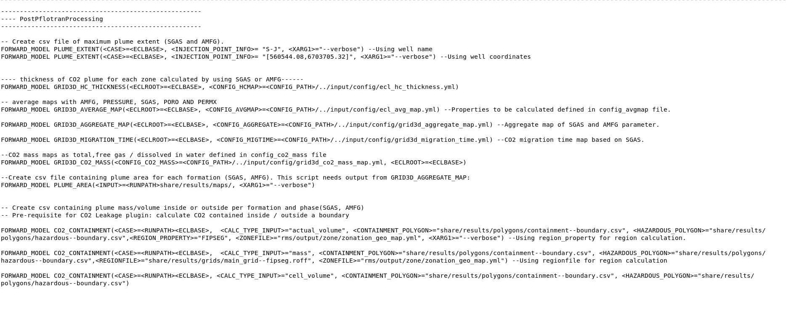

# Overview

## About Weviz

Webviz is designed for analysing FMU model results.

More documentation on Webviz: [Drogon example](https://webviz-subsurface-example.azurewebsites.net/how-was-this-made)


## Available scripts

**Maps**

| Maps      | Description |
| ----------- | ----------- |
| [Migration time map](mig-time.md)     | Returns one map per formation showing the time it takes for the CO2 to migrate to a certain point (only SGAS).|
| [Aggregation map](agg-map.md)   | Returns one map per formation returning the highest saturation per location (in SGAS & AMFG). |
| [Mass map](mass-map.md)   | Returns one map per formation showing the aggregated mass of CO2.         |

**General scripts**

| Scripts      | Description |
| ----------- | ----------- |
| [Plume extent](plume-extent.md)      | Calculates the maximum distance of the CO2 plume to the injector or another point (as gas or CO2 dissolved in water).|
| [Plume area](plume-area.md)   | Calculates the plume area per formation in terms of CO2 as gas or CO2 dissolved in water (input: Max saturation maps). |
| [CO2 containment](co2-containment.md)   | Calculates how much CO2 is inside or outside a boundary (as a volume or mass). Pre-requisite to the CO2 leakage plugin.|

**Webviz plugin**

| Plugin      | Description |
| ----------- | ----------- |
| [CO2 leakage](co2-leakage.md)   | Plugin dedicated to surveiling and quantifying how much CO2 leaks outside the field's license boundary or any other area defined by the user.|


##ERT config file - example

Each of these scripts and command lines are detailed in there respected sections (general scripts, maps, plugin). 
Here is a screenshot of ERT config file with all available scripts:




For simplicity, you can also copy-paste all the lines:

``` yaml
-----------------------------------------------------
---- PostPflotranProcessing
-----------------------------------------------------

-- Create csv file of maximum plume extent (SGAS and AMFG). 
FORWARD_MODEL PLUME_EXTENT(<CASE>=<ECLBASE>, <INJECTION_POINT_INFO>= "S-J", <XARG1>="--verbose") --Using well name 
FORWARD_MODEL PLUME_EXTENT(<CASE>=<ECLBASE>, <INJECTION_POINT_INFO>= "[560544.08,6703705.32]", <XARG1>="--verbose") --Using well coordinates


---- thickness of CO2 plume for each zone calculated by using SGAS or AMFG------
FORWARD_MODEL GRID3D_HC_THICKNESS(<ECLROOT>=<ECLBASE>, <CONFIG_HCMAP>=<CONFIG_PATH>/../input/config/ecl_hc_thickness.yml)

-- average maps with AMFG, PRESSURE, SGAS, PORO AND PERMX
FORWARD_MODEL GRID3D_AVERAGE_MAP(<ECLROOT>=<ECLBASE>, <CONFIG_AVGMAP>=<CONFIG_PATH>/../input/config/ecl_avg_map.yml) --Properties to be calculated defined in config_avgmap file.

FORWARD_MODEL GRID3D_AGGREGATE_MAP(<ECLROOT>=<ECLBASE>, <CONFIG_AGGREGATE>=<CONFIG_PATH>/../input/config/grid3d_aggregate_map.yml) --Aggregate map of SGAS and AMFG parameter.

FORWARD_MODEL GRID3D_MIGRATION_TIME(<ECLROOT>=<ECLBASE>, <CONFIG_MIGTIME>=<CONFIG_PATH>/../input/config/grid3d_migration_time.yml) --CO2 migration time map based on SGAS.

--CO2 mass maps as total,free gas / dissolved in water defined in config_co2_mass file 
FORWARD_MODEL GRID3D_CO2_MASS(<CONFIG_CO2_MASS>=<CONFIG_PATH>/../input/config/grid3d_co2_mass_map.yml, <ECLROOT>=<ECLBASE>) 

--Create csv file containing plume area for each formation (SGAS, AMFG). This script needs output from GRID3D_AGGREGATE_MAP:
FORWARD_MODEL PLUME_AREA(<INPUT>=<RUNPATH>share/results/maps/, <XARG1>="--verbose")


-- Create csv containing plume mass/volume inside or outside per formation and phase(SGAS, AMFG)
-- Pre-requisite for CO2 Leakage plugin: calculate CO2 contained inside / outside a boundary

FORWARD_MODEL CO2_CONTAINMENT(<CASE>=<RUNPATH><ECLBASE>,  <CALC_TYPE_INPUT>="actual_volume", <CONTAINMENT_POLYGON>="share/results/polygons/containment--boundary.csv", <HAZARDOUS_POLYGON>="share/results/polygons/hazardous--boundary.csv",<REGION_PROPERTY>="FIPSEG", <ZONEFILE>="rms/output/zone/zonation_geo_map.yml", <XARG1>="--verbose") --Using region_property for region calculation.

FORWARD_MODEL CO2_CONTAINMENT(<CASE>=<RUNPATH><ECLBASE>,  <CALC_TYPE_INPUT>="mass", <CONTAINMENT_POLYGON>="share/results/polygons/containment--boundary.csv", <HAZARDOUS_POLYGON>="share/results/polygons/hazardous--boundary.csv",<REGIONFILE>="share/results/grids/main_grid--fipseg.roff", <ZONEFILE>="rms/output/zone/zonation_geo_map.yml") --Using regionfile for region calculation

FORWARD_MODEL CO2_CONTAINMENT(<CASE>=<RUNPATH><ECLBASE>, <CALC_TYPE_INPUT>="cell_volume", <CONTAINMENT_POLYGON>="share/results/polygons/containment--boundary.csv", <HAZARDOUS_POLYGON>="share/results/polygons/hazardous--boundary.csv")

```