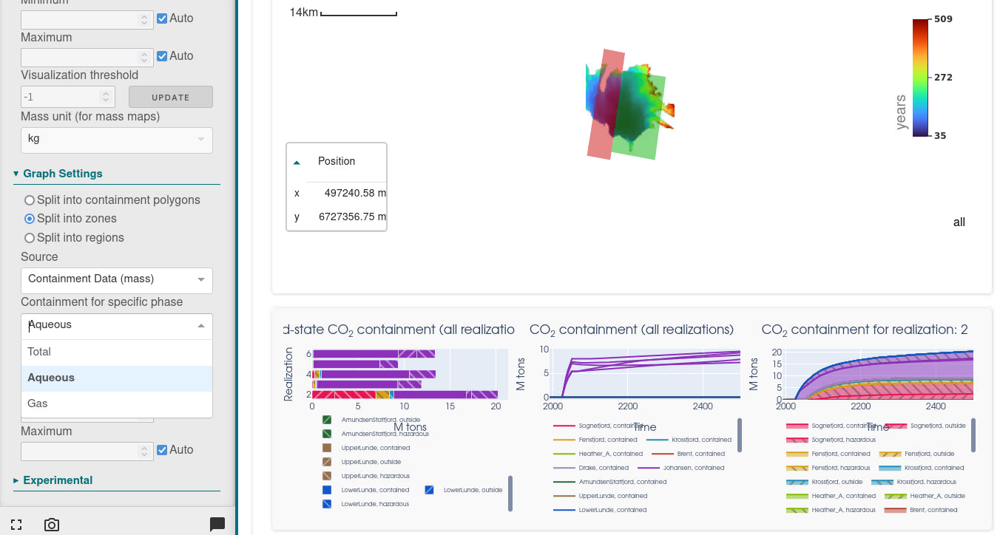
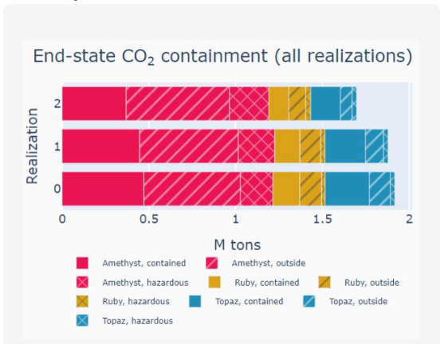

# Plume extent

## 🎯 Overview

Plugin available on Webviz. Allows to visualize CO2 plume maps and see if / how much CO2 is inside / outside given boundaries (polygons, zones, regions).

## 📝 How to set it up?

### Webviz

✅ Available on Komodo

*More to come*

## 📚 Other config file example

## 🔧 Versions & Updates

**Future development**

- Legend update on regions / zones options - icons between inside/outside will change.

 
 

**Updates**

- **12.03.24** - New CO2 leakage  layout available on Komodo bleeding. Allows for zones and regions filtering. 

