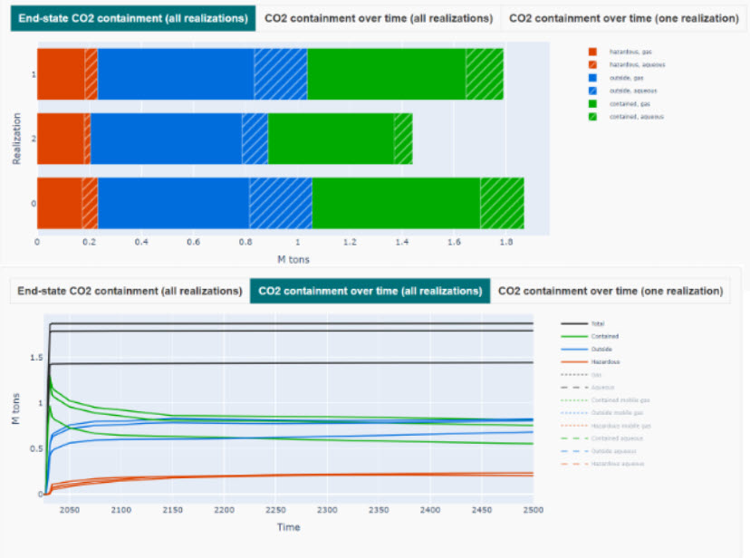

# CO2 leakage plugin

## 🎯 Overview

Plugin available on Webviz. Allows to visualize CO2 plume maps and see if / how much CO2 is inside / outside given boundaries (polygons, zones, regions).

## 📝 How to set it up?

### Webviz

✅ Available on Komodo bleeding

~~~ yaml title="Input to Webviz config file to use CO2 Leakage plugin"

~~~

Detailed explainations on each parameters:

- `ensembles`: Which ensembles in shared_settings to visualize.
- `file_containment_boundary`: Path to a polygon representing the containment area
- `file_hazardous_boundary`: Path to a polygon representing the hazardous area
- `well_pick_file`: Path to a file containing well picks
- `co2_containment_relpath`: Path to a table of co2 containment data (amount of CO2 outside/inside a boundary), for co2 mass. Relative to each realization.
- `co2_containment_volume_actual_relpath`: Path to a table of co2 containment data (amount of CO2 outside/inside a boundary), for co2 volume of type "actual". Relative to each realization.
- `co2_containment_volume_actual_simple_relpath`: Path to a table of co2 containment data (amount of CO2 outside/inside a boundary), for co2 volume of type "actual_simple". Relative to each realization.
- `unsmry_relpath`: Relative path to a csv version of a unified summary file
- `fault_polygon_attribute`: Polygons with this attribute are used as fault polygons
- `map_attribute_names`: Dictionary for overriding the default mapping between attributes visualized by the plugin and attributes names used by EnsembleSurfaceProvider
- `initial_surface`: Name of the surface/formation to show when the plugin is launched. If no name is provided, the first alphabetical surface is shown.
- `map_surface_names_to_well_pick_names`: Optional mapping between surface map names and surface names used in the well pick file
- `map_surface_names_to_fault_polygons`: Optional mapping between surface map names and surface names used by the fault polygons

## 📚 Other config file example

## 🔧 Versions & Updates

**Future development**

In progress:

- Return % of co2 inside, outside and in the hazardeous area.

- New layout where plots are put in different tabs. It allows to visualize the plots better. A sliding scale as also been added to so the ratio between the map and the graph can be changed (map smaller and graphs bigger or opposite). 

 
 

**Updates**

- **March 24**
    
    - New CO2 leakage  layout available on Komodo bleeding. Allows for zones and regions filtering. 
    - A feedback button has been added. See an error? Let us know!

