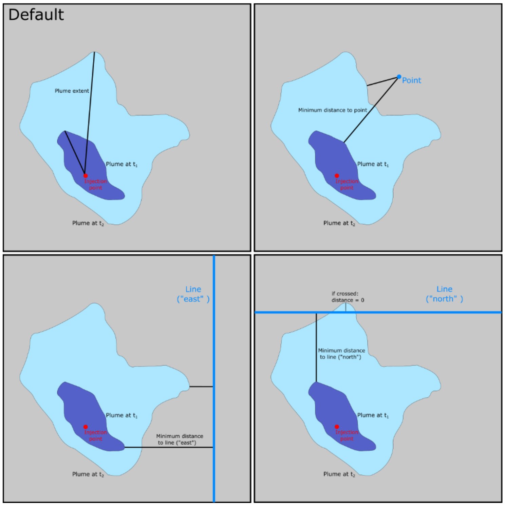

# Plume extent

## 🎯 Overview

Calculates the maximum distance of the CO2 plume to the injector or another point (as gas or CO2 dissolved in water).

**Limitations**

Only calculates the maximum distance from 1 injector. 


## 📝 How to set it up?

### ERT

✅ Available on Komodo


``` yaml
FORWARD_MODEL CO2_PLUME_EXTENT(<CASE>=<ECLBASE>, <INJECTION_POINT_INFO>="S-J", <XARG1>= "--verbose")
```

## 📚 Other examples

``` yaml title="Calculates max extent for a well called S-J using [x,y] coordinates"
FORWARD_MODEL CO2_PLUME_EXTENT(<CASE>=<ECLBASE>, <INJECTION_POINT_INFO>= [560544,6703705], <XARG2> = "--debug")
```

## 🔧 Versions & Updates

**Future development**

- Ensure 2+ injectors can be used. 

- Evaluate adding script extentsion from Smeaheia in this code; script calculates the minimum distance of the plume to a point or line:


<br />
<br />

**Updates**

**May 2024:**

- ERT arguments updated to include injection_point_info which takes either a well name or well coordinates.
- "--verbose" option. Outputs all the calculation steps during the ERT run in the .STDERR file.
- "--debug" option. Outputs all the calculation steps and extra information during the ERT run in the .STDERR file.

